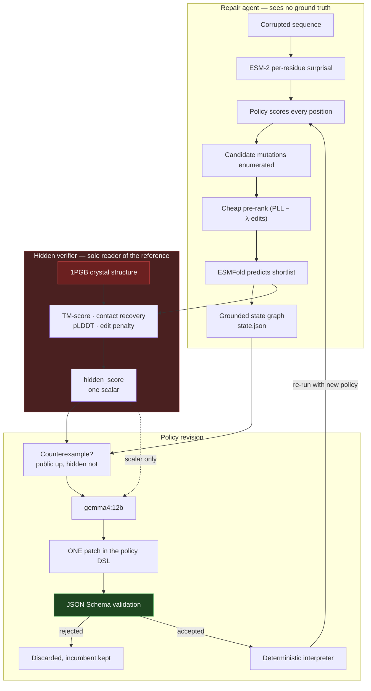

# ReFold

**A protein-repair agent that rewrites its own search strategy when a hidden verifier disagrees with it.**

ReFold takes a damaged protein sequence, repairs it, and is then told only *one bit*
about how well it did. From that, a local LLM rewrites the agent's search policy —
not its code, a constrained policy language — and the search runs again with
different behaviour.

Verified end-to-end on real models: ESM-2 for sequence plausibility, ESMFold for
structure prediction, gemma4:12b for policy revision.

```
corrupted 1PGB                          hidden score 0.5699
  baseline policy   sites [50, 21, 55]  12 mutations proposed
                    picked P50A         hidden score 0.8026   (+0.233)
  gemma4:12b        "Increasing positions and substitutions per position
                     expands the search space, allowing for more diverse
                     mutations to be explored."
  revised policy    sites [50, 21, 55, 48, 11]   31 mutations proposed
                    picked P50M         hidden score 0.8080
```

Position 50 was a proline dropped into a beta strand. ESM-2 flagged it as the most
implausible residue in the chain **without ever seeing the reference structure**,
and reverting it produced the +0.233 jump.

---

## Problem

Two things are easy to get wrong when an ML system "fixes" a protein.

1. **The plausible answer and the correct answer are not the same.** A sequence
   model will happily propose a substitution that looks statistically natural and
   makes the fold worse. If you let the agent grade its own homework using the same
   signals it optimises, you learn nothing.
2. **A self-improving agent that writes code is unfalsifiable and unsafe.** If the
   improvement step can emit arbitrary Python, you cannot say what the system is
   allowed to do, and you cannot tell a real improvement from a reward hack.

## Solution

ReFold separates the three roles that usually get collapsed together.

| Role | Sees | Cannot see |
|---|---|---|
| **Repair agent** | corrupted sequence, its own predicted structure | anything derived from the reference structure |
| **Hidden verifier** | the reference crystal structure | — |
| **Policy reviser** (Gemma) | grounded state graph, candidate outcomes, one scalar score | the reference structure, the score's decomposition |

Three design commitments make that hold:

- **The verifier is withheld.** TM-score, contact recovery and sequence recovery are
  computed against the real 1PGB crystal structure, and the agent is returned only a
  single scalar. The decomposition is unlockable exactly once, from one script.
- **Gemma never emits code.** Its only output channel is a fixed policy DSL — four
  scoring weights and three search parameters — validated against a JSON Schema
  before the interpreter will touch it. An out-of-vocabulary patch is *rejected*,
  never coerced.
- **The disagreement is the training signal.** When the agent's public signals
  improve but the hidden score does not, that counterexample is logged verbatim and
  handed to Gemma as the thing to explain.

## Architecture



The red boundary is enforced by executable tests, not convention: no file under
`src/agent/` may contain the string `native` or `SEQRES`, only `src/evaluator.py`
may name the reference path, and `reveal=True` may be passed from exactly one
script. See [`tests/test_constraints.py`](tests/test_constraints.py).

## Tech stack

| Layer | Choice | Why |
|---|---|---|
| Sequence model | `facebook/esm2_t12_35M_UR50D` | masked-marginal surprisal; small enough to score 56 positions in seconds |
| Structure model | `facebook/esmfold_v1` | single-sequence folding, no MSA; ~40 s per 56-residue chain on CPU |
| Policy reviser | `gemma4:12b` via Ollama | runs locally, constrained JSON decoding |
| Verifier geometry | own TM-score (`src/geometry.py`) | `tmtools` ships no cp313 wheel; cross-checked against the real thing |
| UI | Streamlit + py3Dmol / stmol | one page, one button |
| Validation | jsonschema, PyYAML | the policy DSL is data, never code |
| Tests | pytest — 167 passing | including the four safety constraints |

## Repository structure

```
├── app/streamlit_app.py        the demo UI: one page, one button
├── src/
│   ├── mvp.py                  the demo driver — one corruption, one Gemma patch
│   ├── evaluator.py            hidden verifier; ONLY reader of data/proteins/
│   ├── geometry.py             contacts, TM-score, superposition
│   ├── pdb_io.py               minimal PDB parsing
│   ├── demo.py                 multi-generation driver (research path)
│   ├── agent/                  everything that must not see ground truth
│   │   ├── esm_score.py        surprisal, PLL, substitution ranking
│   │   ├── grounder.py         sequence + structure → state.json
│   │   ├── policy.py           DSL loading and validation
│   │   ├── policy.schema.yaml  the DSL — the only vocabulary Gemma may speak
│   │   ├── policy.yaml         seed policy
│   │   ├── policy_interpreter.py   deterministic; no dynamic execution
│   │   ├── inner_loop.py       repair loop, selects on public signals only
│   │   ├── outer_loop.py       keep-if-better on the median hidden score
│   │   ├── outer_loop_client.py    Gemma transport + patch validation
│   │   └── counterexamples.py  logs where prediction and reality diverge
│   └── cache/
│       ├── fold_cache.py       ESMFold with a disk cache
│       └── synthetic_backend.py    labelled fixture backend, NOT a predictor
├── web/                        the demo deployed to Vercel
│   ├── index.html              one page; see web/README.md for what it can't do
│   ├── app.js                  rendering, viewer, policy editor, sequence input
│   ├── policy.js               browser port of the DSL + interpreter (no model)
│   ├── esm.js                  in-browser ESM-2 masked-marginal scoring
│   └── data/                   generated by scripts/build_web_data.py
├── scripts/                    setup and the MVP demo
│   ├── build_web_data.py       committed artefacts → web/data/
│   └── research/               the fuller roadmap: holdout, ablation, reveal
├── tests/                      167 tests; test_constraints.py guards the boundary
├── data/
│   ├── proteins/1pgb/          reference structure — evaluator-only
│   ├── corruptions/1pgb/       corrupted variants — agent-visible
│   ├── evaluator_only/         which positions were damaged (withheld)
│   └── cache/                  38 predicted structures, committed
├── docs/
│   ├── ARCHITECTURE.md         design decisions and engineering notes
│   └── ROADMAP.md              the full research plan this MVP is carved from
├── DEMO.md                     presenter runbook
├── vercel.json                 static-site config for the web/ demo
├── run_mvp.sh                  launcher (macOS / Linux)
└── run_mvp.ps1                 launcher (Windows)
```

## Installation

Requires Python 3.10+ (verified on 3.13.13, Windows 11, CPU-only) and
[Ollama](https://ollama.com).

```powershell
git clone <repo-url>
cd Recursive-self-improvement-for-protein-design-optimization

pip install -r requirements.txt

# Gemma (~7.6 GB)
ollama pull gemma4:12b

# ESMFold checkpoint (~8.4 GB, resumable — safe to interrupt)
python scripts/fetch_esmfold.py

# confirm both model paths load on this machine
python scripts/smoke_test.py --with-fold
```

Torch must come from the CPU index unless you want the multi-GB CUDA build:

```powershell
pip install torch --index-url https://download.pytorch.org/whl/cpu
```

The reference protein and its corrupted variants are already committed. To
regenerate them from scratch:

```powershell
python scripts/fetch_protein.py 1pgb
python scripts/make_corruptions.py 1pgb
```

## Running locally

```bash
./run_mvp.sh --check        # pre-flight: ollama, checkpoint, cache coverage
./run_mvp.sh                # start the app on http://localhost:8501
```

On Windows:

```powershell
.\run_mvp.ps1 -Check
.\run_mvp.ps1
```

Then press **Run ReFold** at the bottom of the page. Takes ~105 s, almost all of
it Gemma.

`data/cache/` ships with the 38 structures this demo needs, so no folding is
required. If you change the protein or corruption, re-warm the cache once:

```bash
./run_mvp.sh --precompute   # ~13 min, ~40 s per structure
```

Command line instead of the UI:

```bash
python scripts/run_mvp_once.py           # same code path, live Gemma
python scripts/run_mvp_once.py --mock    # canned patch, no model call
python -m pytest tests/ -q               # 167 tests
```

The test suite has no heavy dependencies. Model-backed tests are marked and skip
themselves with a clear reason when torch and transformers are absent, so a clean
clone runs 153 tests with nothing but `numpy`, `PyYAML`, `jsonschema`, `jsonlines`
and `pytest` installed.

## Demo instructions

See **[DEMO.md](DEMO.md)** for the presenter runbook: what to say, in what order,
and the failure modes worth knowing about in advance. The short version:

1. **Left column** — the original 1PGB sequence, the corrupted input with its five
   damaged sites in red, and the table of what was changed. The agent never sees
   that table.
2. **Press Run ReFold.** The timeline narrates each step as it happens.
3. **Middle column** — predicted structure, the per-residue substitution heatmap,
   and the candidate lists: **12 mutations proposed → 31** after Gemma's patch.
4. **Right column** — Gemma's reasoning verbatim, the unified diff of the policy,
   and the scores: **0.5699 → 0.8026 → 0.8080**.

## Deployment

`web/` is what deploys to Vercel. `vercel.json` sets `outputDirectory` to `web/`
with a no-op build; `.vercelignore` keeps the Python project out of the upload so
zero-config detection does not try to build a serverless function from
`requirements.txt`.

```bash
python scripts/build_web_data.py            # regenerate web/data/ from committed artefacts
python3 -m http.server 8765 --directory web # preview at http://localhost:8765
```

It replays the recorded run, and two parts of it you can drive directly:

- **Rewrite the policy yourself.** The DSL controls run the project's real
  interpreter, ported to the browser from `src/agent/policy_interpreter.py`. It
  needs no model — the interpreter is pure arithmetic over a grounded state.
  The seed policy reproduces round 1 exactly (3 sites, 12 proposals) and
  "Apply Gemma's patch" reproduces round 2 (5 sites, 31 proposals). Invalid
  policies are rejected, never coerced, by the same rules `validate_policy` uses.
- **Score your own sequence.** ESM-2 runs in the browser via transformers.js on
  the ONNX export of the same `facebook/esm2_t12_35M_UR50D` checkpoint, loaded
  as fp16 because int8 error is large enough to reorder the position ranking.
  Any pasted protein gets the identical masked-marginal treatment.

**Structure prediction does not run on Vercel, and no configuration makes it.**
Streamlit needs a long-lived WebSocket server; `torch` alone exceeds the 250 MB
unzipped function limit; the ESMFold checkpoint is 8.4 GB and gitignored; and
Gemma is served by a local Ollama process that has no serverless equivalent. So a
sequence you paste gets sequence-plausibility signals and the policy search that
runs on them — and no TM-score, no contact recovery and no hidden score, because
all three need a fold and a reference crystal structure. The page says this on its
face. See **[web/README.md](web/README.md)** for the provenance rules and the
precision measurements.

To host the *full* interactive app, use somewhere that can run a persistent
process with GPU or large-CPU memory — Hugging Face Spaces, Render, Fly.io — and
expect to supply the checkpoint and an Ollama endpoint yourself.

## Current limitations

Stated plainly, because a hackathon judge should not have to find these themselves.

- **One generation, one corruption, one protein.** The multi-generation loop,
  blind holdout and ablation exist under `scripts/research/` and `src/demo.py` but
  are not part of the demo.
- **Gemma chose a mechanism patch, not a representation patch.** The more
  interesting move — activating the unused `long_range_contact_violation` feature so
  the agent starts scoring long-range contact loss — is implemented and reachable,
  but the model preferred to widen the search. Genuine model behaviour, not a
  scripted result.
- **No counterexample fires on `corrupt_01`.** With real ESMFold the public and
  hidden signals agree on this variant, so the "looked better, actually worse" beat
  is absent from the headline run. The recorder works and is test-covered; the
  variant simply does not trigger it.
- **The second repair gains only +0.005.** The large improvement is baseline vs
  corrupted (+0.233). One extra round on a 56-residue protein has little room left.
- **TM-score is our own implementation, accurate only in the range that matters.**
  `tmtools` has no cp313 wheel and its sdist needs MSVC.
  `scripts/validate_tm_score.py` cross-checks against the real `tmtools` under a
  Python 3.12 interpreter: agreement is **0.00015** for TM ≥ 0.74 and exact at 1.0,
  but it underestimates by up to **0.06** below TM 0.5, because it does not
  reproduce TM-align's multi-cutoff refinement. Every candidate the evaluator scores
  is a single-point mutant sitting at TM ≈ 0.85–0.98, so the demo numbers are inside
  the accurate band — but a future version scoring badly-broken structures would
  need the real thing.
- **Not biology.** This repairs synthetic point mutations against a known crystal
  structure. It does not design a therapeutic, does not repair function in any
  organism, and makes no claim to have found new protein physics.

## Future work

- Let the counterexample drive a representation patch end to end, on a variant
  where the public and hidden signals genuinely diverge.
- Run the median keep-if-better loop over several generations and report the blind
  holdout score (`scripts/research/`).
- The ESM-only vs contact-aware ablation, reported either way
  (`scripts/research/ablation.py`).
- Second protein (ubiquitin, 1UBQ) with zero changes under `src/` — the
  generalisation check.
- Batch ESMFold on GPU; at ~40 s per structure on CPU, cache warming dominates.

## Documentation

| Document | Contents |
|---|---|
| [DEMO.md](DEMO.md) | presenter runbook, verified run, failure modes |
| [docs/ARCHITECTURE.md](docs/ARCHITECTURE.md) | design decisions, the four constraints, engineering notes |
| [docs/ROADMAP.md](docs/ROADMAP.md) | the full research plan this MVP is carved from |
| [CONTRIBUTING.md](CONTRIBUTING.md) | layout rules, how to run the checks |

## Licence

MIT — see [LICENSE](LICENSE). Model weights and the PDB entry carry their own terms.
